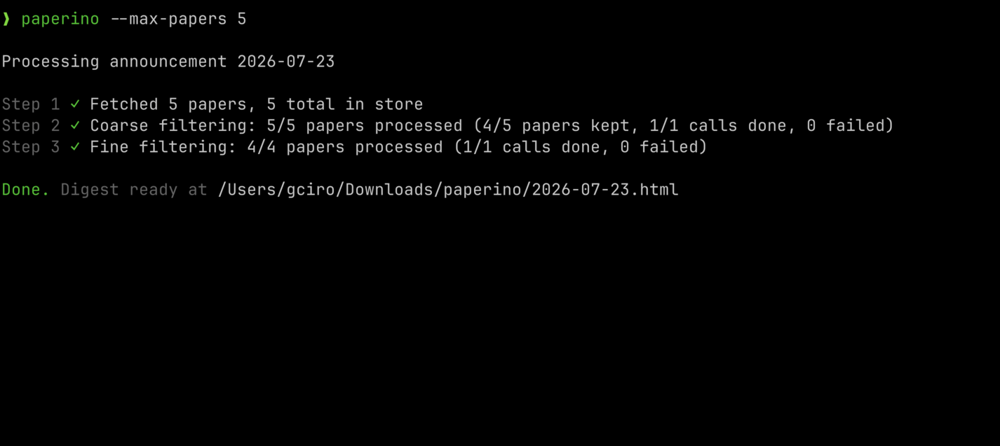

<h1 align="center">paperino</h1>

<p align="center">
  <a href="https://www.npmjs.com/package/@giacomo-ciro/paperino"></a>
  <a href="https://www.npmjs.com/package/@giacomo-ciro/paperino"></a>
</p>

> Every new arXiv paper, every day, filtered by your agent down to what's actually worth your time.


<p align="center">
  
</p>

I work on a 3D vision project. On average, ~100 new papers are published daily in the cs.CV category on [arXiv](https://arxiv.org/list/cs.CV/recent).

Of those, <40 look relevant from the title, and <5 are actually worth reading after scanning the abstract.

Existing tools based on similarity search or embeddings (Scholar Inbox, arXiv Sanity, etc.) aren't precise enough.

Your chosen agent delivers precise filtering tailored to your exact research project, running fresh every day. Paperino supports both Claude Code and Codex.

Scanning the results then takes just 5-10 minutes, and you stay up to date with the latest research.

<p align="center">
  
</p>

## Getting Started
Paperino is a CLI utility, fully configurable via a simple .toml file. It produces an HTML digest locally and can email it through Gmail.

Install it globally:
```
npm install -g @giacomo-ciro/paperino
```

Set it up:
```
paperino --configure    # walks you through setup with a few questions
```

**Requirements:** [Claude Code](https://claude.com/claude-code) or [Codex](https://developers.openai.com/codex/cli), installed and signed in.

## Usage

Run it manually to produce an HTML digest locally:
```
paperino
```
Or email the digest to the configured recipient:
```
paperino --email
```
Email delivery uses the Gmail sender account and Google app password collected by `paperino --configure`. Setup sends a test email and asks you to confirm receipt before enabling delivery. It requires [2-Step Verification and an app password](https://support.google.com/mail/answer/185833?hl=en). The sender account routes the email; the recipient can be any address. The app password is stored as plain text in `~/.paperino/config.toml`.

Some examples:
```
paperino --configure                     # interactively configure paperino
paperino --logs                          # tail the log file; no pipeline run
paperino --force                         # discard the run/digest for the selected announcement(s) and start fresh
paperino --only-fetch                    # only fetch papers, skip the scoring pipeline
paperino --email                         # email each completed digest to the configured recipient
paperino --last 3                        # catch up on the latest 3 arXiv announcements
paperino --max-papers 50                 # cap each announcement at 50 papers (most recently submitted first)
paperino --quiet                         # run non-interactively and only print the digest path — what a cron job wants
```

Or, as I do, run every weekday at 9:30 AM. Open the crontab:
```bash
crontab -e
```
and add:
```bash
# minute 30, hour 9, Mon-Fri
30 9 * * 1-5 paperino --quiet --email
```
Cron runs with a minimal `PATH` and won't see your shell's setup, so `paperino` may not resolve. Run `which paperino` and use the full path instead. If your Node is managed by a version manager like nvm, cron also needs to find `node` — get both directories with `dirname "$(which node)"` and `dirname "$(which paperino)"`, then set them above the schedule:
```bash
PATH=/home/you/.nvm/versions/node/v24.15.0/bin:/home/you/.npm-global/bin:/usr/bin:/bin
30 9 * * 1-5 paperino --quiet --email
```
> **Note:** arXiv announces new submissions at 20:00 ET on Sun/Mon/Tue/Wed/Thu. Running at 9:30 AM CET (3:30 ET) ensures the run always lands after the prior evening's announcement, catching all five announcements without needing to run on weekends.

## How It Works

**Preliminaries:** arXiv announces new papers 5 times a week, on Sun, Mon, Tue, Wed and Thu at 20:00 US Eastern time. Full details are on the [official announcement schedule](https://info.arxiv.org/help/availability.html#Announcement%20Schedule).

Paperino is minimal, built to work efficiently. It follows a 3-step process:

1. **Fetching papers:** fetch the papers from the selected arXiv announcement (by default, the latest one). This step only filters by arXiv category (cs.LM, cs.CV, etc.).
2. **Coarse filtering:** Your configured agent receives your research context and a batch of titles per call (default 20), and outputs a binary relevant/not-relevant judgment. This step is kept coarse: papers are marked as potentially relevant when the agent is unsure.
3. **Fine filtering:** The agent receives a smaller batch of title+abstract pairs per call and scores each paper on a scale of 1-10. Papers scoring above 6 get a full summary in the HTML digest; the rest get a one-line mention.

All aforementioned parameters are configurable (what model to use, papers per call, max papers, threshold score etc.):
```
paperino --configure
```

The setup wizard lets you choose Claude Code or Codex and configure a model for each pass. Existing configurations continue to use Claude Code unless you select Codex.

## Acknowledgments
This tool was initially inspired by [AlessandroMorosini/arxiv-digest](https://github.com/AlessandroMorosini/arxiv-digest). Code-wise, I took inspiration from [kunchenguid/gnhf](https://github.com/kunchenguid/gnhf).
